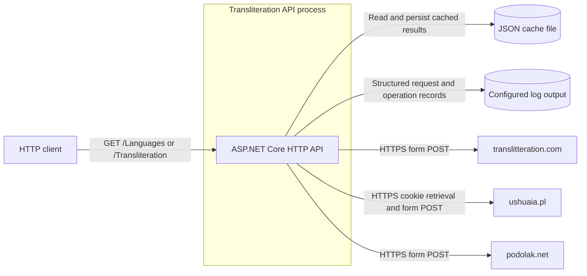
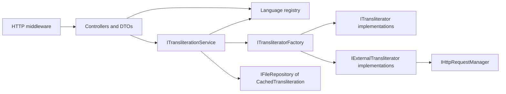
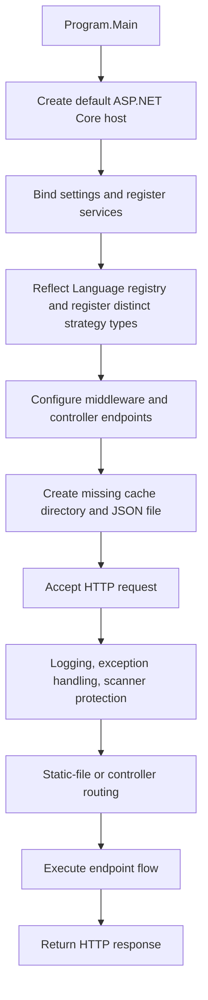
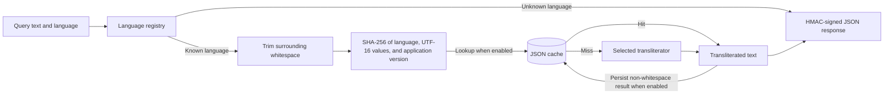
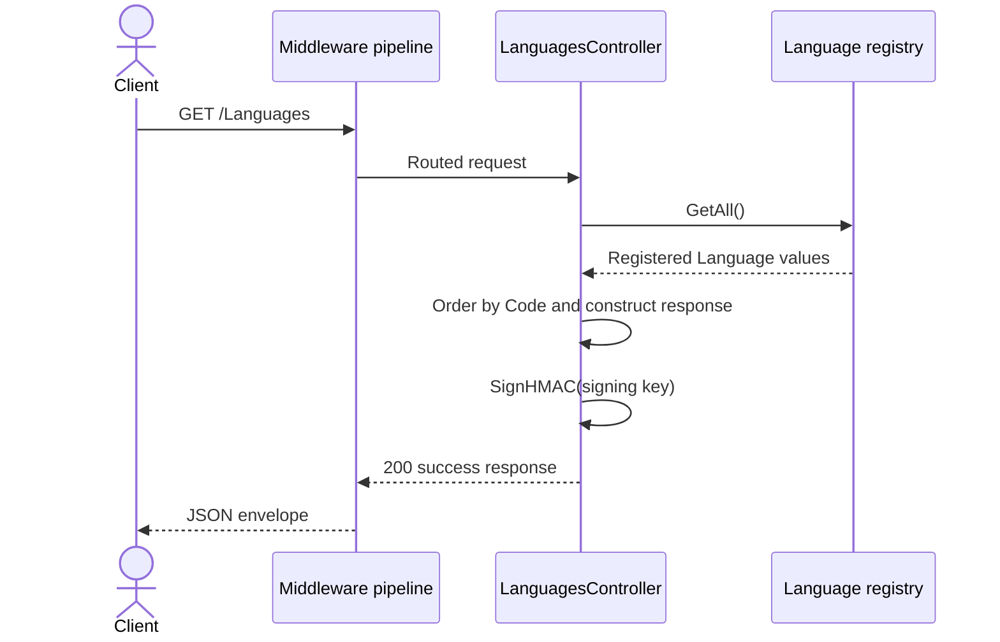
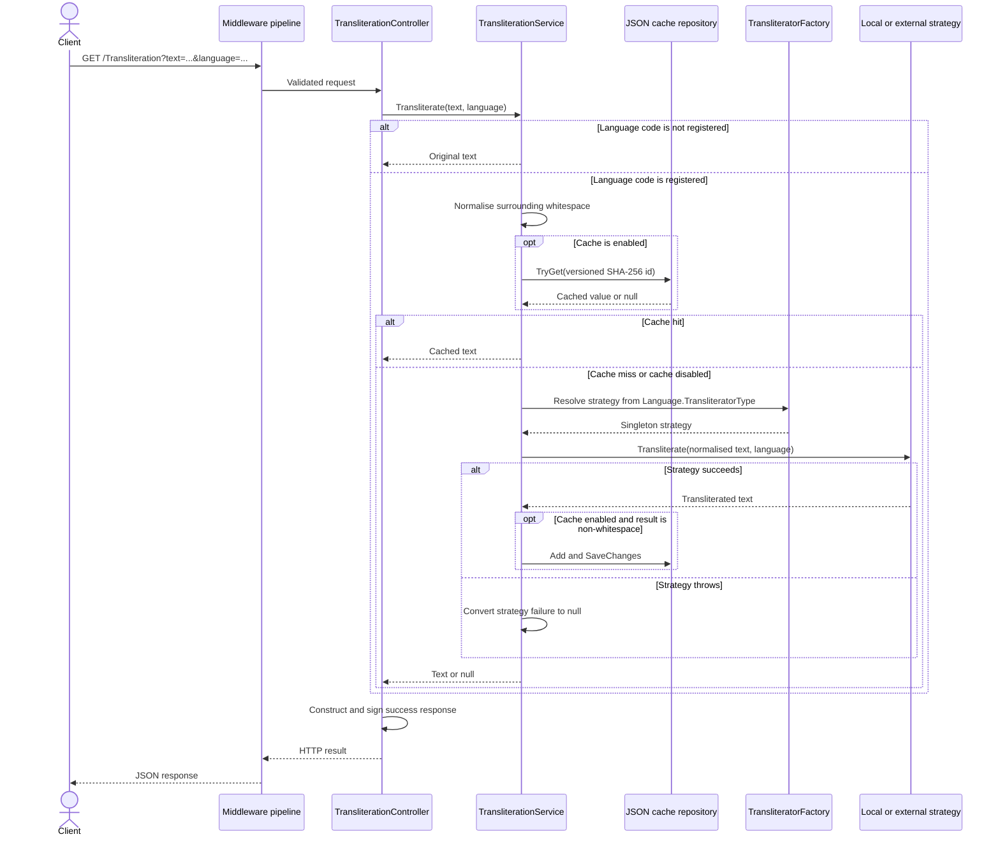
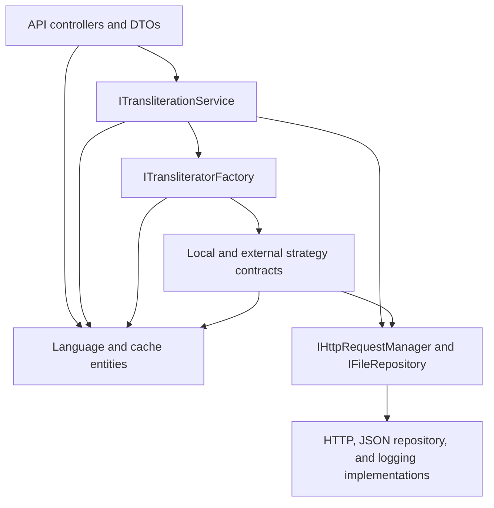

# Transliteration API Architecture

This document describes the current architecture of the Transliteration API. It covers the ASP.NET Core process, HTTP and provider boundaries, transliteration dispatch, file-backed caching, cross-cutting middleware, and verification projects; it does not propose a target architecture.

## 📑 Table of Contents

- [Purpose](#purpose)
- [System Context](#system-context)
- [Architectural Style](#architectural-style)
- [Runtime Flow](#runtime-flow)
- [Components](#components)
- [Architectural Areas](#architectural-areas)
  - [Host and Composition](#host-and-composition)
  - [API Transport](#api-transport)
  - [Application and Data](#application-and-data)
  - [Transliteration Strategies](#transliteration-strategies)
  - [Verification](#verification)
- [Data Architecture](#data-architecture)
- [Interfaces and Integrations](#interfaces-and-integrations)
- [Key Flows](#key-flows)
  - [Language Discovery](#language-discovery)
  - [Transliteration and Cache Resolution](#transliteration-and-cache-resolution)
- [Language Registry and Transliterator Dispatch](#language-registry-and-transliterator-dispatch)
- [Cross-Cutting Concerns](#cross-cutting-concerns)
  - [Security and Privacy](#security-and-privacy)
  - [Error Handling](#error-handling)
  - [Observability](#observability)
  - [Configuration](#configuration)
  - [Concurrency and Resource Use](#concurrency-and-resource-use)
- [Dependency Direction and Rules](#dependency-direction-and-rules)
- [External Dependencies](#external-dependencies)
- [Deployment and Operations](#deployment-and-operations)
- [Compatibility Contracts](#compatibility-contracts)
- [Testing and Verification](#testing-and-verification)
- [Design Constraints](#design-constraints)
- [Extension Points](#extension-points)
  - [Add a Local Transliterator](#add-a-local-transliterator)
  - [Add an External Provider](#add-an-external-provider)
  - [Replace Cache Persistence](#replace-cache-persistence)
- [Source Map](#source-map)
- [Related Documentation](#related-documentation)

## 🎯 Purpose

The service transliterates text from registered writing systems into the Latin alphabet and exposes the authoritative language registry. This document records the ownership boundaries and change-sensitive contracts that contributors require when modifying routes, language mappings, transliteration algorithms, provider adapters, caching, middleware, or deployment configuration.

The repository contains one deployable API project and separate unit and integration verification projects. The document describes only implemented behaviour visible in the current source.

## 🌐 System Context

An HTTP client invokes either language discovery or transliteration. The API performs local algorithms for some languages and transmits normalised text to one of three remote providers for others. It can persist successful results in a local JSON cache and emit structured logs to a configured destination.



The principal external boundaries are:
- **HTTP clients:** Supply untrusted route, query, and header data and receive JSON or middleware-generated error responses. Both application endpoints use `NuciApiAuthorisation.None`.
- **Local filesystem:** Stores the JSON cache and, under the default logger configuration, the log file. The process requires access appropriate to the configured locations.
- **Remote transliteration providers:** Receive normalised source text for registry entries assigned to an external transliterator. They are third-party availability and protocol boundaries.
- **Response-signing secret:** `SecuritySettings.HmacSigningKey` crosses the deployment configuration boundary and signs success responses. It is not an authentication mechanism or encryption key for request data.

## 🏗️ Architectural Style

The application is a layered, single-process ASP.NET Core service. Controllers form the transport boundary, `TransliterationService` is the application orchestrator, registry-selected strategies implement transliteration, and infrastructure adapters own file and network access. Dependency injection composes these layers, while strategy and repository abstractions isolate application orchestration from concrete transliterators and persistence.



The principal architecture boundaries are:
- **Transport boundary:** Middleware, model binding, controllers, response envelopes, and HMAC signing own HTTP concerns.
- **Application boundary:** `ITransliterationService` owns language validation, normalisation, cache policy, strategy dispatch, and fallback semantics.
- **Strategy boundary:** `ITransliterator` and `IExternalTransliterator` own language-specific transformations without knowledge of controllers or cache persistence.
- **Infrastructure boundary:** `IHttpRequestManager`, NuciDAL repositories, and NuciLog own outbound I/O and diagnostics.
- **Registry boundary:** `Language` is the compile-time source of language codes, display names, implementation types, and local-versus-external dispatch metadata.

## 🔄 Runtime Flow



The principal runtime sequence is:
1. [`Program`](TransliterationAPI/Program.cs) creates the default .NET host and selects [`Startup`](TransliterationAPI/Startup.cs).
2. `Startup.ConfigureServices` adds controllers, binds settings, registers scanner protection, and invokes [`ServiceCollectionExtensions`](TransliterationAPI/ServiceCollectionExtensions.cs).
3. Composition registers the cache repository, HTTP manager, each distinct registry-selected transliterator type, factory, application service, and logger as singletons. ASP.NET Core activates controllers for requests.
4. `Startup.Configure` orders request logging, exception handling, scanner protection, the development exception page when applicable, default and static files, routing, authorisation, and controller endpoints.
5. Startup creates the configured cache directory and an empty JSON array when the cache file does not exist. Existing content is preserved.
6. Requests traverse middleware and routing before an endpoint executes. Success responses are signed in their controller before serialisation.

## 🧩 Components

| Component | Responsibility | Principal Dependencies | Lifetime or Ownership |
|-----------|----------------|------------------------|-----------------------|
| `Program` and `Startup` | Construct the host, service provider, middleware pipeline, routes, and initial cache store | ASP.NET Core, configuration | Application lifetime |
| `LanguagesController` | Return code-sorted registry metadata and sign the response | `Language`, `SecuritySettings`, NuciAPI controller base | Framework-created controller instance |
| `TransliterationController` | Bind the query request, invoke application orchestration, and sign the response | `ITransliterationService`, `SecuritySettings`, NuciAPI controller base | Framework-created controller instance |
| `TransliterationService` | Validate language codes, normalise text, apply cache policy, dispatch strategies, and convert strategy failures to nullable results | `ITransliteratorFactory`, `IFileRepository<CachedTransliteration>`, `ILogger`, `CacheSettings` | Singleton |
| `TransliteratorFactory` | Resolve the registry-selected implementation from the service provider under the synchronous or external contract | `IServiceProvider`, `Language` | Singleton |
| Local transliterators | Perform in-process character mapping and language-specific post-processing | `ILogger`, `Language` | One singleton per distinct implementation type |
| External transliterators | Construct provider requests, parse responses, and apply provider-specific corrections | `IHttpRequestManager`, `ILogger`, `Language` | One singleton per distinct implementation type |
| `HttpRequestManager` | Reuse one `HttpClient` and `CookieContainer` for provider GET and POST operations with a three-second timeout | `HttpClientHandler`, `CookieContainer` | Singleton |
| `JsonRepository<CachedTransliteration>` | Retrieve and persist cache entities in the configured JSON file | `CacheSettings.StoreLocation` | Singleton |
| `Language` | Maintain immutable registry entries and implementation metadata | Reflection over public static `Language` properties | Process-wide static registry |
| `NuciLogger` | Record request, orchestration, and strategy execution diagnostics | Bound logger settings | Singleton |

## 🗂️ Architectural Areas

### Host and Composition

Paths:
- [TransliterationAPI/Program.cs](TransliterationAPI/Program.cs)
- [TransliterationAPI/Startup.cs](TransliterationAPI/Startup.cs)
- [TransliterationAPI/ServiceCollectionExtensions.cs](TransliterationAPI/ServiceCollectionExtensions.cs)
- [TransliterationAPI/Configuration/](TransliterationAPI/Configuration/)

Responsibilities:
- Construct the ASP.NET Core process and middleware order.
- Bind configuration and define service lifetimes.
- Derive transliterator registration from the language registry.
- Initialise missing persistent cache storage.

Boundary rules:
- Runtime composition belongs here rather than in controllers or strategies.
- Registry-selected implementation types must be resolvable under their declared strategy contract.

### API Transport

Paths:
- [TransliterationAPI/API/Controllers/](TransliterationAPI/API/Controllers/)
- [TransliterationAPI/API/Requests/](TransliterationAPI/API/Requests/)
- [TransliterationAPI/API/Responses/](TransliterationAPI/API/Responses/)

Responsibilities:
- Define routes, query binding, validation, JSON response models, and response signing.
- Delegate transliteration orchestration to `ITransliterationService`.
- Publish registry metadata in a stable serialisable form.

Boundary rules:
- Controllers do not select concrete transliterators or perform provider I/O.
- Transport DTOs do not own persistence or domain algorithms.

### Application and Data

Paths:
- [TransliterationAPI/Service/TransliterationService.cs](TransliterationAPI/Service/TransliterationService.cs)
- [TransliterationAPI/Service/ITransliterationService.cs](TransliterationAPI/Service/ITransliterationService.cs)
- [TransliterationAPI/Service/Entities/](TransliterationAPI/Service/Entities/)

Responsibilities:
- Own the ordered transliteration procedure and cache policy.
- Define registry and cache entities.
- Isolate HTTP transport from strategy and repository details.

Boundary rules:
- Unknown language codes return the original input before normalisation or persistence.
- Strategy exceptions become nullable transliteration results; cache and orchestration exceptions remain visible to outer error handling.

### Transliteration Strategies

Paths:
- [TransliterationAPI/Service/Transliterators/](TransliterationAPI/Service/Transliterators/)
- [TransliterationAPI/Service/HttpRequestManager.cs](TransliterationAPI/Service/HttpRequestManager.cs)
- [TransliterationAPI/Service/IHttpRequestManager.cs](TransliterationAPI/Service/IHttpRequestManager.cs)

Responsibilities:
- Implement local script conversion or external provider protocols.
- Retain language-specific lookup tables, mappings, response parsing, and post-processing.
- Centralise provider transport behind `IHttpRequestManager`.

Boundary rules:
- Strategies receive a `Language`; provider routing does not depend upon controller route values directly.
- External strategies raise provider and parsing failures to the application service, which owns degradation semantics.

### Verification

Paths:
- [TransliterationAPI.UnitTests/](TransliterationAPI.UnitTests/)
- [TransliterationAPI.IntegrationTests/](TransliterationAPI.IntegrationTests/)

Responsibilities:
- Verify language algorithms and registry composition at unit level.
- Exercise the complete HTTP pipeline, middleware, routing, HMAC contracts, cache lifecycle, registry completeness, and provider adapter protocols at integration level.

Boundary rules:
- Integration tests substitute remote HTTP and logging while retaining the production host, middleware, controllers, service, strategies, and filesystem repository.
- Test cache state is isolated under a temporary directory per application factory.

## 💾 Data Architecture

The service owns no relational database. Runtime state consists of immutable registry metadata, configuration singletons, a JSON cache, shared provider-session state, and per-request DTOs. Successful transliterations can persist across process restarts when caching is enabled.



| Data or Store | Owner | Representation and Storage | Lifecycle or Consistency |
|---------------|-------|----------------------------|--------------------------|
| `GetTransliterationRequest` | API transport | Query-bound `Text` and `Language`; `Text` has a maximum .NET string length of 256 UTF-16 code units | Per request; model validation precedes controller execution |
| `GetTransliterationResponse` | Transliteration controller | Success envelope plus nullable `text` and `hmac` in JSON | Per request; signed after orchestration completes |
| `GetLanguagesResponse` | Languages controller | Success envelope plus code-sorted `languages`, computed `count`, and `hmac` | Per request; deterministic for an unchanged registry and key |
| `Language` registry | `Language` static initialiser | In-memory dictionary keyed by exact, case-sensitive language code | Initialised once; no runtime mutation API |
| `CachedTransliteration` | `TransliterationService` and NuciDAL repository | JSON object containing a SHA-256 `id` and `transliteratedText` | Added after a successful non-whitespace result; no expiry or eviction policy |
| Cache file | NuciDAL repository and startup | JSON array at `CacheSettings.StoreLocation`, `cache.json` by default | Created when absent; retained across restarts; application version participates in identity rather than deleting prior entries |
| Ushuaia session state | `UshuaiaTransliterator` | Mutable cookie value and retrieval timestamp in memory | Shared by the singleton adapter; refreshed after five minutes according to local process time |

The cache identity is the lowercase hexadecimal SHA-256 digest of a string containing the language code, hyphen-separated integer values for each UTF-16 character, and `CacheSettings.ApplicationVersion`. Surrounding whitespace is removed before identity calculation. Raw source text is therefore absent from the cache entity, although transliterated output remains persisted.

When caching is disabled, the service bypasses both reads and writes. Unknown language codes also bypass the cache. Empty, whitespace-only, or failed strategy results are not persisted. The application defines no cache migration, size limit, expiry, compaction, or cross-process coordination.

## 🔌 Interfaces and Integrations

| Interface or Integration | Direction | Contract | Owner | Failure Semantics |
|--------------------------|-----------|----------|-------|-------------------|
| `GET /Languages` | Inbound | No application query fields; JSON success envelope with `languages`, `count`, and `hmac` | `LanguagesController` | Unhandled faults pass to NuciAPI exception middleware |
| `GET /Transliteration` | Inbound | Query-bound `text` and `language`; `text` maximum length 256; JSON success envelope with nullable `text` and `hmac` | `TransliterationController` | Model errors produce ASP.NET Core validation responses; outer faults pass to exception middleware |
| [translitteration.com](https://www.translitteration.com/) | Outbound | Form POST with `text`, mapped `tlang`, `script=latn`, and mapped `scheme`; response prefix `ack:::` is removed | `TranslitterationDotComTransliterator` | HTTP and adapter failures become `text: null` through service degradation |
| [ushuaia.pl](https://www.ushuaia.pl/transliterate/) | Outbound | Cookie retrieval followed by form POST with `text`, mapped `lang`, and a `Cookie` header | `UshuaiaTransliterator` | Session, HTTP, and adapter failures become `text: null` through service degradation |
| [podolak.net](https://podolak.net/en/transliteration/old-church-slavonic) | Outbound | Form POST for Old Church Slavonic; result parsed from an `ausgabe` textarea line | `PodolakTransliterator` | Missing or malformed result data becomes `text: null` through service degradation |
| JSON cache | Bidirectional | NuciDAL `IFileRepository<CachedTransliteration>` operations over one configured file | `TransliterationService` | Read, parse, or persistence faults escape strategy degradation and reach exception middleware |
| Logger | Outbound | NuciLog operation status and contextual `LogInfo` records | Middleware, service, strategy base classes | Logger implementation and configuration own destination failure behaviour |

## 🔀 Key Flows

### Language Discovery



The endpoint does not invoke `TransliterationService`, cache persistence, or remote providers. `Language.TransliteratorType` and `Language.UsesExternalTransliterator` are excluded from JSON; the public representation contains `code`, `name`, and the implementation type name in `transliterator`.

### Transliteration and Cache Resolution



The application intentionally distinguishes strategy failures from orchestration failures. A strategy failure produces a signed success envelope whose `text` can be `null`. Cache corruption, filesystem faults, signing faults, and other exceptions outside `TryGetTransliteratedText` remain available to middleware translation.

## 🔤 Language Registry and Transliterator Dispatch

[`Language`](TransliterationAPI/Service/Entities/Language.cs) declares 49 public static language properties. Its static constructor reflects over public static properties of type `Language`, adds each code to an internal dictionary, and rejects duplicate codes during type initialisation through the dictionary contract.

Each registry value contains:
- A case-sensitive public code.
- A display name.
- A concrete transliterator `Type` used for DI registration and factory resolution.
- A computed public implementation name for the `/Languages` payload.
- A computed local-versus-external classification based upon `IExternalTransliterator` assignability.

The identical metadata controls three behaviours:
1. `/Languages` discovery output.
2. Singleton registration of every distinct concrete strategy.
3. Runtime strategy resolution and synchronous-versus-asynchronous dispatch.

This convention keeps registration and dispatch aligned, but makes registry edits architecture-sensitive. A new static `Language` property is automatically discovered; its code must be unique, its type must be concrete and registered by the derived registration loop, and its type must implement the interface implied by `UsesExternalTransliterator`.

## 🧵 Cross-Cutting Concerns

### Security and Privacy

Both application endpoints are anonymous. `UseAuthorization` is present in the pipeline, but controllers invoke the NuciAPI request processor with `NuciApiAuthorisation.None`. HMAC signing supplies response integrity and authenticity to clients that possess the configured key; it does not provide request authentication, confidentiality, or replay prevention.

Scanner-protection middleware executes before routing and rejects configured probe paths, query patterns, and headers. Its rules and in-memory client blocking behaviour belong to the NuciAPI middleware package and are locked by integration tests.

Source text crosses privacy boundaries in three possible locations:
- Service and strategy log context includes source and transliterated text.
- External-language requests transmit normalised source text to the selected remote provider.
- Cache records retain transliterated output. Their identifiers are hashes derived from source UTF-16 values, language code, and application version; the raw source string is not a cache field.

The signing key is bound from configuration. The repository contains a deployment placeholder rather than a functional secret. Operators own secure value injection and file access controls.

### Error Handling

Error ownership has three levels:
- ASP.NET Core model validation rejects text beyond the declared maximum before controller logic.
- NuciAPI exception middleware translates exceptions escaping the application into standard HTTP statuses and error envelopes.
- `TransliterationService.TryGetTransliteratedText` catches every exception raised during local or external strategy execution and converts it to a nullable result.

`TransliterationService.Transliterate` logs and rethrows failures outside the strategy-degradation boundary. External HTTP operations call `EnsureSuccessStatusCode`; no retry policy is implemented. Provider failures can therefore degrade an otherwise valid request to a signed `200` response with `text: null`, while cache and orchestration failures are middleware-visible.

### Observability

Request middleware records HTTP activity. `TransliterationService` records started, successful, and failed operations with source text and language code. Local and external strategy base classes independently record execution status with language and implementation context.

The default configuration activates file output at `logfile.log`. The repository defines no metrics, distributed traces, health endpoint, or explicit log correlation contract. Logs can contain user-supplied text and require corresponding retention and access controls.

### Configuration

| Configuration Area | Source | Responsibility | Override or Secret Policy |
|--------------------|--------|----------------|---------------------------|
| `CacheSettings` | [`TransliterationAPI/appsettings.json`](TransliterationAPI/appsettings.json) via `IConfiguration` | Cache activation and filesystem location; application version is computed from the entry assembly | Default host configuration can supply environment-specific overrides |
| `SecuritySettings` | [`TransliterationAPI/appsettings.json`](TransliterationAPI/appsettings.json) via `IConfiguration` | HMAC signing key | Repository value is a placeholder; runtime provisioning owns the secret |
| `NuciLoggerSettings` | [`TransliterationAPI/appsettings.json`](TransliterationAPI/appsettings.json) via NuciLog registration | Log destination and file-output activation | Default host configuration can supply environment-specific overrides |
| Host settings | .NET default host configuration and process arguments | Environment, URLs, content root, and standard ASP.NET Core host conduct | Standard .NET configuration precedence applies |

Settings are bound and registered once during startup. The application contains no explicit configuration validation or dynamic reload consumption.

### Concurrency and Resource Use

Local transformations execute synchronously within an asynchronous controller request. External calls are asynchronous, but one singleton `HttpRequestManager` owns a shared `HttpClient` and `CookieContainer`. All concrete transliterators are singletons; `UshuaiaTransliterator` additionally maintains a shared session-cookie value and timestamp.

The application adds no per-key cache coalescing, repository lock, or distributed coordination. Consequently, concurrent cache misses can execute duplicate transliterations, and multi-process deployments do not receive coherence from the application layer. Safety of simultaneous JSON repository operations depends upon NuciDAL implementation details beyond this repository.

The inbound text limit bounds query-model string length at 256 UTF-16 code units. Outbound provider calls use a three-second `HttpClient` timeout. The cache has no capacity bound.

## 🧭 Dependency Direction and Rules

Dependencies progress from transport toward application orchestration, strategy contracts, and infrastructure. Registry and configuration models are consumed across lower layers but do not depend upon transport.



The principal dependency rules are:
- Controllers may depend upon application interfaces, request and response DTOs, settings, and registry metadata; they do not depend upon concrete provider adapters.
- `TransliterationService` owns orchestration and depends upon abstractions for strategy resolution and persistence.
- Provider-specific URLs, form fields, cookie conventions, and parsing remain inside the corresponding external transliterator.
- Local transliterators remain independent of HTTP and cache persistence.
- The production project does not reference either test project; both test projects reference the production project.
- Adding a registry entry and adding its implementation are one coherent change, since the registry drives DI registration and factory dispatch.

## 📦 External Dependencies

| Dependency | Responsibility | Integration Boundary | Architectural Consequence |
|------------|----------------|----------------------|---------------------------|
| .NET 10 and ASP.NET Core | Hosting, routing, model binding, dependency injection, JSON serialisation, static files | Host and API transport | Defines process lifecycle and HTTP conventions |
| NuciAPI packages | Controller request processing, success and error envelopes, request logging, exception translation, scanner protection | Middleware and controllers | Public envelope and middleware semantics depend upon pinned package versions |
| NuciSecurity.HMAC | Generate and validate response HMAC tokens | NuciAPI response models | Deterministic payload shape is compatibility-sensitive |
| NuciDAL | `IFileRepository<T>` and JSON repository persistence | Cache adapter | Cache file semantics and concurrent file access rely upon package behaviour |
| NuciLog | Structured application and strategy logging | Composition and operation wrappers | User-supplied text enters configured logs |
| CHSPinYinConv | Chinese character-to-Pinyin conversion | `PinyinTransliterator` | Chinese conversion depends upon package character coverage |
| NuciExtensions | Title-case transformations used by several strategies | Local and external transliterators | Post-processing semantics depend upon extension implementation |
| Remote transliteration providers | Conversion for registry entries without local algorithms | Three external transliterator adapters | Availability and undocumented response formats can produce nullable results |

Exact package versions are pinned in [`TransliterationAPI.csproj`](TransliterationAPI/TransliterationAPI.csproj).

## 🚀 Deployment and Operations

The deployment unit is one ASP.NET Core process. It hosts both routes, all middleware, all strategies, the cache repository, the provider HTTP client, and logger state. The process requires .NET 10, writable configured cache and log locations, and outbound HTTPS access when external languages are requested.

| Concern | Current Design | Architectural Consequence |
|---------|----------------|---------------------------|
| Process topology | One web process with in-process singleton services | Restarting the process resets provider session and scanner state but retains filesystem data |
| Persistent state | Local JSON cache at a configured path | Operators must preserve, inspect, or remove the file directly; corrupt JSON can prevent cache-backed requests from succeeding |
| Startup | Existing cache content is retained; a missing file is initialised to `[]` | The process requires directory and file creation permissions at startup |
| Horizontal scaling | Each process uses its configured local repository and in-memory state | Independent local files are not coherent; a genuinely shared file would require external coordination not supplied here |
| Provider availability | External-language requests make direct three-second HTTP calls | No retry, queue, circuit breaker, or provider health model is implemented |
| Static content | Default and static-file middleware are active | Static-file requests share the API process, although no web-root content is required by the API contract |
| Continuous integration | GitHub Actions restores, compiles, and tests on Ubuntu with .NET 10 | Linux verification is automated; deployment packaging remains external to the workflow |
| Health and recovery | No health endpoint, cache repair, or automated cache restore exists | Operators rely upon process status, logs, and filesystem inspection |

## 🛡️ Compatibility Contracts

| Contract | Owner | Invariant | Verification | Change Policy |
|----------|-------|-----------|--------------|---------------|
| HTTP routes | Controllers | `GET /Languages` and `GET /Transliteration` remain controller-derived routes | Integration routing tests | Route or verb changes are externally breaking |
| Transliteration query | Request DTO and service | `text` maximum length 256; exact language-code matching; unknown code returns original text | Endpoint and service integration tests | Alter only with explicit API contract revision |
| Success envelopes | Response DTOs and NuciAPI | `success`, `message`, `code`, `hmac`, and endpoint-specific fields remain serialisable | HMAC and endpoint contract tests | Payload changes can invalidate clients and signatures |
| Language discovery item | `Language` and languages controller | Public item contains `code`, `name`, and `transliterator`; runtime `Type` metadata remains excluded | Languages endpoint tests | Preserve shape or introduce a versioned contract |
| Registry codes | `Language` | Codes are unique, case-sensitive identifiers tied to one strategy type | Registry and registered-language integration tests | Existing code remapping changes observable output and cache identity |
| Cache identity and schema | `TransliterationService` and `CachedTransliteration` | SHA-256 identifier derives from normalised text UTF-16 values, language, and application version; entities contain `id` and output text | Cache integration tests | Algorithm or schema changes require deliberate invalidation or migration |
| Provider request formats | External transliterator adapters | URLs, form fields, language mappings, cookies, and response parsing correspond to current providers | Provider-specific integration tests with a recording HTTP manager | Provider protocol changes remain confined to the owning adapter |
| Middleware order | `Startup` | Logging wraps exception handling and scanner protection before routing | Full-pipeline integration tests | Reordering requires security and error-contract regression verification |

## ✅ Testing and Verification

[`TransliterationAPI.UnitTests`](TransliterationAPI.UnitTests/) verifies local transliteration algorithms, provider post-processing, registry composition, and focused service collaborators. [`TransliterationAPI.IntegrationTests`](TransliterationAPI.IntegrationTests/) starts the production host with `WebApplicationFactory`, supplies a loopback address required by request logging, isolates cache storage, and replaces remote HTTP and logging dependencies with deterministic implementations.

Integration coverage includes:
- Route matching, HTTP verbs, content negotiation, query binding, and the 256-unit boundary.
- NuciAPI exception mapping and scanner-protection cases.
- Success envelopes, cryptographic HMAC validation, wrong-key rejection, and payload-tamper rejection.
- Cache creation, normalisation, hits, misses, disabled mode, persistence across hosts, malformed storage, and data minimisation.
- Every registered language and each active provider mapping.
- Exact remote URL, form, cookie, parsing, fallback, and retry-by-subsequent-request behaviour.
- Composition, singleton lifetimes, startup filesystem conduct, and registry completeness.

Tests intentionally perform no genuine remote provider requests. They do not validate third-party availability, live HTML compatibility, concurrent load, multi-process cache access, or the five-minute Ushuaia session refresh under elapsed wall-clock time.

Execute the principal automated verification with:

```bash
dotnet test TransliterationAPI.slnx -v minimal
```

Execute only full-pipeline integration verification with:

```bash
dotnet test TransliterationAPI.IntegrationTests/TransliterationAPI.IntegrationTests.csproj -v minimal
```

## ⚠️ Design Constraints

- **Compile-time registry:** Languages are discovered from static properties by reflection. Runtime registration, configuration-only additions, and plug-in loading are not implemented.
- **Exact language matching:** Codes are case-sensitive. Unknown or missing codes return the original text without normalisation, provider access, or caching.
- **Nullable degradation:** Every strategy exception is suppressed by the service and represented as a successful signed response with `text: null`; clients cannot infer provider failure type from that response.
- **Local persistence:** The JSON cache has no expiry, eviction, capacity limit, transaction boundary defined in this repository, or distributed coherence.
- **Shared singleton state:** Provider HTTP cookies, Ushuaia session fields, transliterator instances, the repository, and logger are shared across requests in one process.
- **Provider coupling:** External adapters depend upon third-party form fields and response formats, including HTML extraction for Podolak.
- **Input length semantics:** `StringLength(256)` measures .NET string length, so supplementary Unicode symbols consume two UTF-16 code units.
- **HMAC scope:** Signing protects response integrity for holders of the shared key; it does not authenticate callers or conceal text.
- **Privacy exposure:** Source and result text can enter logs, and external languages transmit normalised source text to third parties.
- **Operational visibility:** No metrics, distributed tracing, readiness probe, or health endpoint is implemented.

## 🔧 Extension Points

### Add a Local Transliterator

1. Implement `ITransliterator`, normally by deriving from `Transliterator`, in [TransliterationAPI/Service/Transliterators/](TransliterationAPI/Service/Transliterators/).
2. Add one public static `Language` property with a unique code, display name, and concrete type in [`Language.cs`](TransliterationAPI/Service/Entities/Language.cs).
3. Add focused algorithm tests and full-pipeline cases that verify registry discovery, exact output, cache persistence, and absence of outbound HTTP.

No manual service-registration line is necessary: composition registers each distinct type discovered from `Language.GetAll()`. The type must implement `ITransliterator`; otherwise factory casting fails at runtime.

### Add an External Provider

1. Implement `IExternalTransliterator`, normally by deriving from `ExternalTransliterator`, and depend upon `IHttpRequestManager` for network access.
2. Encapsulate endpoint URLs, provider language mappings, request construction, parsing, and post-processing within that adapter.
3. Add registry entries whose types implement `IExternalTransliterator`, then add recording-manager integration tests for every mapping, malformed response, timeout, and cache interaction.

External strategies are singleton services. Any mutable session state must therefore account for concurrent requests and process-wide reuse.

### Replace Cache Persistence

1. Supply an implementation of `IFileRepository<CachedTransliteration>` or revise the application-owned persistence abstraction if the substitute cannot satisfy that contract.
2. Replace the singleton registration in [`ServiceCollectionExtensions.cs`](TransliterationAPI/ServiceCollectionExtensions.cs).
3. Preserve cache-hit semantics, identifier compatibility, disabled-cache bypass, non-persistence of failed results, and relevant startup responsibilities through integration tests.

The current startup routine specifically creates a JSON array file. A non-file repository also requires revising that host responsibility rather than retaining an irrelevant filesystem side effect.

## 🗺️ Source Map

| Area | Path |
|------|------|
| Solution composition | [`TransliterationAPI.slnx`](TransliterationAPI.slnx) |
| Deployable API project | [TransliterationAPI/](TransliterationAPI/) |
| Process startup | [`TransliterationAPI/Program.cs`](TransliterationAPI/Program.cs), [`TransliterationAPI/Startup.cs`](TransliterationAPI/Startup.cs) |
| Dependency registration | [`TransliterationAPI/ServiceCollectionExtensions.cs`](TransliterationAPI/ServiceCollectionExtensions.cs) |
| API transport | [TransliterationAPI/API/](TransliterationAPI/API/) |
| Configuration models and defaults | [TransliterationAPI/Configuration/](TransliterationAPI/Configuration/), [`TransliterationAPI/appsettings.json`](TransliterationAPI/appsettings.json) |
| Application orchestration | [`TransliterationAPI/Service/TransliterationService.cs`](TransliterationAPI/Service/TransliterationService.cs) |
| Registry and cache entities | [TransliterationAPI/Service/Entities/](TransliterationAPI/Service/Entities/) |
| Strategy contracts and implementations | [TransliterationAPI/Service/Transliterators/](TransliterationAPI/Service/Transliterators/) |
| Outbound HTTP adapter | [`TransliterationAPI/Service/HttpRequestManager.cs`](TransliterationAPI/Service/HttpRequestManager.cs) |
| Logging vocabulary | [TransliterationAPI/Logging/](TransliterationAPI/Logging/) |
| Unit verification | [TransliterationAPI.UnitTests/](TransliterationAPI.UnitTests/) |
| Full-pipeline verification | [TransliterationAPI.IntegrationTests/](TransliterationAPI.IntegrationTests/) |
| Continuous integration | [`.github/workflows/dotnet.yml`](.github/workflows/dotnet.yml) |

## 📚 Related Documentation

- [`README.md`](README.md) provides usage, configuration, development commands, API examples, and supported-language orientation.
- [`SECURITY.md`](SECURITY.md) defines supported versions, vulnerability-reporting channels, disclosure procedure, and security scope.
